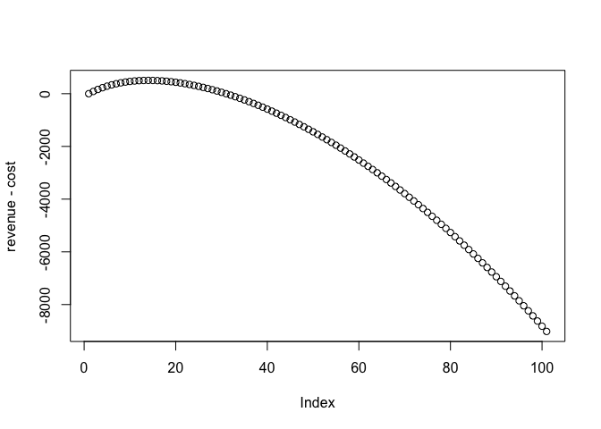
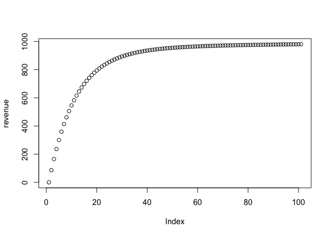
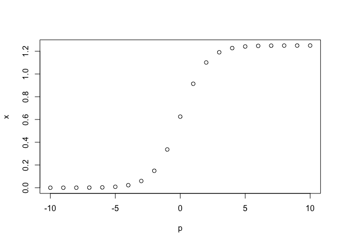

<!-- README.md is generated from README.Rmd. Please edit that file -->

# Something about MPAs and Bycatch

Repo for manuscript exploring the ways in which habitat overlap, fleet
spillover, and MPA design strategies can interact to affect conservation
and fishery outcomes of MPAs, focused on WCPO-ish system.

starginw thi hastings botsford weakstock species etc. can you hedge
around this or not?Build intuition around BWMPAs for weakstocks

Covariance matrix across species: perfectly correlated to totally
uncorrelated and everything in between

Clean up by setting Hastings and Botsford as a perfect template for
this. PNAS? Isolate the life history

It is clear that if species are mutually exclusive, there is no
potential for overlap protection… but where does it fall when overlap is
something in between

Hmmm you could use virtual species.. or I guess that’s even too
complicated

What if you just picked an “environmental” variable, and generated a
random matrix

For each species, you then assign a beta to that variable, where when
they are all the same the covariance across the species is high. When
they are all near zero there is no correlation, when they are opposite
signs they are negatively correlated?

Suppose you had two variables actually. One specifies kind of the
“default” distributino for all species. The other is an environmental
variable, and species can have coefficients that on average range from
all 1, evenly split 1 and -1, and near zero

Ah ok what about this. YOu define a set of benchmark species, where
those benchmark species are defined by their relationship to a habitat.
FOr the remainder of the species, their habitat is on average with noise
on a gradient from -1 to 1, where one means they have the same as the
benchmark, 0 means they are uncorrlated with the benchmark species, and
-1 they are negatively correlated.

``` r
library(marlin)
library(tidyverse)
#> ── Attaching packages ─────────────────────────────────────── tidyverse 1.3.1 ──
#> ✓ ggplot2 3.3.5     ✓ purrr   0.3.4
#> ✓ tibble  3.1.4     ✓ dplyr   1.0.7
#> ✓ tidyr   1.1.3     ✓ stringr 1.4.0
#> ✓ readr   2.0.1     ✓ forcats 0.5.1
#> ── Conflicts ────────────────────────────────────────── tidyverse_conflicts() ──
#> x dplyr::filter() masks stats::filter()
#> x dplyr::lag()    masks stats::lag()
theme_set(marlin::theme_marlin())

resolution <- 20 # resolution is in squared patches, so 20 implies a 20X20 system, i.e. 400 patches 

seasons <- 1

years <- 50

tune_type <- "depletion"

steps <- years * seasons

# for now make up some habitat

base_hab <- expand_grid(x = 1:resolution, y = 1:resolution) %>%
  mutate(habitat =  .05 * x * y) %>% 
  mutate(habitat = as.numeric(scale(habitat)))

 


hab_scenes <- expand_grid(scene = c("friends", "enemies","frenemies"), species = fruit[1:10]) %>% 
  group_by(scene) %>% 
  nest()


generate_hab <- function(species, homogifier = 1,scene,base_hab,sigma_hab = 1, beta_hab = 1){
  
  
  sigma_hab = .2
  
  sigma_block <- 0.1
  
  homogifier <- 0
  
  species <- hab_scenes$data[[1]]
  
  block_a <- species$species[1:5]
  
  block_b <- species$species[6:10]
  
  block_a_betas <- rnorm(length(block_a),1,sigma_block)
  
  block_b_betas <- rnorm(length(block_b), homogifier, sigma_block)
  
  species$betas <- c(block_a_betas, block_b_betas)
  
  species$habitat <- vector(mode = "list", length = nrow(species))
  
  for (i in 1:nrow(species)){
    
    
    base_hab$realized_hab <- rnorm(nrow(base_hab), base_hab$habitat * species$betas[i], sigma_hab)
    
    species$habitat[[i]] <- base_hab
      
    
  }
  

  (species$habitat[[1]] %>% 
    ggplot(aes(x,y,fill = realized_hab))+ 
    geom_tile() + 
    scale_fill_viridis_c()) + 
      (species$habitat[[10]] %>% 
    ggplot(aes(x,y,fill = realized_hab))+ 
    geom_tile() + 
    scale_fill_viridis_c())
  
  
  
}
```

# idea for fleet revamp

I think the most straightforward route is just to build a bit more
realism in.

1.  Burn the model in

2.  Calculate costs such that profit per unit effort is 0, where costs
    are calculated based on f, not effort.

3.  Redistribute effort, and going forward use open access dynamics. So,
    if you set that up right, there will now be a tradeoff between
    increased catch from effort concentration but also increased cost
    from f approaching 1.

Worth a shot

``` r
q <- 0.1

m <- 0.2

effort <- seq(0,100, by = 1)

f <- effort * q

b <- 100

price <- 10

catch <- f / (f + m) * b * (1 - exp(-(f + m)))

biomass <- b * (exp(-(f + m)))

revenue <- catch * price

cost = effort^2


plot(revenue - cost)
```



``` r
plot(revenue)
```



``` r
f <- 10 * q

r1 <- 2 * (f / (f + m) * b * (1 - exp(-(f+ m))) * price - 10^2)

f <- 20 * q

r2 <- (f / (f + m) * b * (1 - exp(-(f+ m))) * price - 20^2)


r1 
#> [1] 964.6763
r2
#> [1] 408.3608
```

Yeah that checks out. So, the idea is what? Run the population to
equilibrium, and then find a cost coefficient such that system-wide
profits are zero

``` r
q <- 0.1

m <- 0.2

effort <-10

f <- effort * q

b <- 100

price <- 10

cost <- 10

max_delta <- 0.25

cost = (f / (f + m) * b * (1 - exp(-(f+ m))) * price) / effort^2

p1 <- (f / (f + m) * b * (1 - exp(-(f+ m))) * price) - cost * effort^2

theta = log((effort * (1 + max_delta)) / effort) / (f / (f + m) * b * (1 - exp(-(f+ m))) * price)

e2 <- effort * exp(theta * (f / (f + m) * b * (1 - exp(-(f+ m))) * price))

e2 / effort - 1
#> [1] 0.25
e2 <- effort * exp(theta * (10000))

e2 / effort
#> [1] 46.14807
# so what if you tuned it so that if you caught all of ssb0 it would go up by 25%
```

What about a sigmoid form, so that it’s symetric in increase vs
decrease?

``` r
p = seq(-10,10)

x = 1.25 * (1 / (1 + exp(-p)))

plot(p,x)
```


